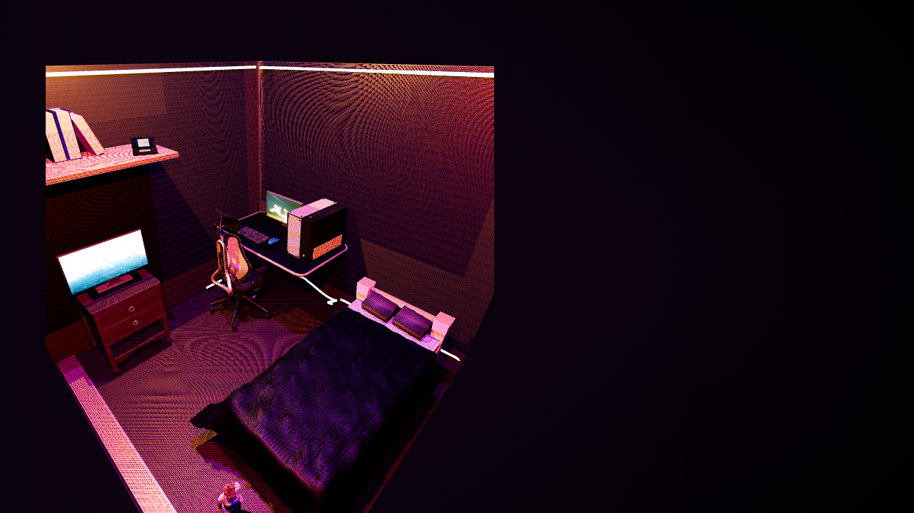

# Interactive 3D Portfolio | Aether115

Welcome to **Aether115's** interactive web portfolio. This site showcases a blend of **Web Development** and **3D Modeling** to deliver an immersive, modern experience.



---

## ✨ Overview
- Real‑time 3D scene built with **Three.js**
- Neon‑purple cyber‑punk visual style with glass‑morphism and dynamic lighting
- Fully responsive layout that works on mobile, tablets and desktops
- Dark‑mode toggle with smooth transitions

---

## 🛠️ Tech Stack
- **HTML5**, **CSS3** (custom design, no frameworks)
- **JavaScript (ES6+)**
- **Three.js** for WebGL rendering
- **Blender** for 3D asset creation (exported as GLTF)
- **Git** for version control

---

## 🎮 Features
- Interactive navigation menu with a mobile‑first hamburger toggle
- Dynamic camera positioning that adapts to the model size and viewport
- Optimized materials and shadows for performance on low‑end devices
- Automatic fallback placeholder if the 3D model fails to load
- Accessibility‑friendly meta tags and semantic HTML

---

## 📦 Project Structure
```
├─ assets/               # Images, GIFs, and the GLTF model
├─ index.html            # Main HTML entry point
├─ styles.css            # Custom CSS with responsive media queries
├─ script.js             # Three.js scene setup and UI logic
├─ README.md             # This documentation file
└─ ...
```

---

## 🚀 Getting Started
1. **Clone the repository**
   ```bash
   git clone https://github.com/Heavenly115/pagina-web.git
   cd pagina-web
   ```
2. **Serve the site locally** (recommended – use any static server, e.g., VS Code Live Server or `npx serve`)
3. Open `http://localhost:<port>` in a browser.

---

## 🛠️ Development
- Run `npm install` if you add build tools later.
- Edit `styles.css` for design tweaks.
- Modify `script.js` to experiment with lighting, camera angles, or 3D assets.
- Use `git add <files>`, `git commit -m "<msg>"`, and `git push` to version your changes.

---

## 📚 Imported Blender Assets
Integration of the following 7 imported 3D models into the scene:
- Furniture (Mueble)
- Chair (Silla)
- Keyboard (Teclado)
- PC Case (Gabinete)
- Mouse
- Nintendo DS
- Jill Valentine

---

## 🎓 Academic Information
- **Professor:** Rodrigo Fidel Gaxiola Sosa
- **Subject:** Computer Graphics (Graficación)
- **Group:** 5sA

---

## 📄 License
This project is licensed under the **MIT License** – feel free to fork, modify, and use it for your own portfolio.

---

*Crafted with passion, code, and Three.js.*
